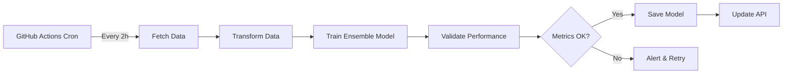

# Production Deployment Guide

## 🚀 Quick Start - GitHub Secrets Setup

### Required Secrets for Production

Configure these secrets in your GitHub repository: `Settings > Secrets and variables > Actions > New repository secret`

#### 1. API Keys (Required)
```
TWELVE_DATA_API_KEY
```
- Get your API key from: https://twelvedata.com
- Free tier: 800 API calls/day
- Required for data fetching

#### 2. MLflow Tracking (Required for Model Registry)
```
MLFLOW_TRACKING_URI=https://dagshub.com/YOUR_USERNAME/Real-Time-MLOps-Pipeline-for-USD-Forecasting.mlflow
MLFLOW_TRACKING_USERNAME=your_username
MLFLOW_TRACKING_PASSWORD=your_dagshub_token
DAGSHUB_TOKEN=your_dagshub_token
```

#### 3. Docker Hub (Required for Container Deployment)
```
DOCKER_USERNAME=your_dockerhub_username
DOCKER_PASSWORD=your_dockerhub_password_or_token
```

#### 4. Railway/Vercel (Optional - for API deployment)
```
RAILWAY_TOKEN=your_railway_token
```

---

## 📋 Deployment Platforms

### Option 1: Railway (Recommended)
Railway offers free tier with automatic deployments.

**Steps:**
1. Connect your GitHub repository to Railway
2. Add environment variables in Railway dashboard:
   - `TWELVE_DATA_API_KEY`
   - `MLFLOW_TRACKING_URI`
   - `MLFLOW_TRACKING_USERNAME`
   - `MLFLOW_TRACKING_PASSWORD`
3. Railway will auto-deploy on push to `main`

**Railway Config:** `railway.json` ✓
**Start Command:** `./start.sh` ✓

### Option 2: Render
Free tier available with 750 hours/month.

**Steps:**
1. Create new Web Service on Render
2. Connect GitHub repository
3. Set environment variables in Render dashboard
4. Build command: `pip install -r requirements.txt`
5. Start command: `./start.sh`

**Render Config:** `render.yaml` ✓

### Option 3: Docker + Cloud Run / ECS
For production-grade deployment.

**Build and Deploy:**
```bash
# Build Docker image
docker build -t usd-volatility-predictor .

# Run locally
docker run -p 8000:8000 \
  -e TWELVE_DATA_API_KEY=$TWELVE_DATA_API_KEY \
  -e MLFLOW_TRACKING_URI=$MLFLOW_TRACKING_URI \
  usd-volatility-predictor

# Deploy to Google Cloud Run
gcloud run deploy usd-volatility-predictor \
  --image usd-volatility-predictor \
  --platform managed \
  --region us-central1 \
  --allow-unauthenticated
```

---

## ⏰ Automated Data Updates (Every 2 Hours)

### GitHub Actions Cron Job ✓

The pipeline automatically runs every 2 hours via GitHub Actions:
- **Workflow:** `.github/workflows/data-pipeline.yml`
- **Schedule:** `0 */2 * * *` (every 2 hours)
- **Tasks:**
  1. Fetch latest USD/EUR data from Twelve Data API
  2. Transform and engineer features
  3. Train optimized ensemble model
  4. Update model artifacts
  5. Commit changes to repository

**Manual Trigger:**
Go to `Actions` tab → `Data Pipeline` → `Run workflow`

### Alternative: Airflow Scheduler

For more complex orchestration, use Apache Airflow:

```bash
# Start Airflow
docker-compose -f infrastructure/docker/docker-compose.yml up -d

# Access UI: http://localhost:8080
# Username: admin
# Password: admin
```

**DAG Configuration:**
- File: `airflow/dags/etl_dag.py`
- Schedule: Every 2 hours ✓
- Tasks: Extract → Transform → Train

---

## 🧪 Model Performance Standards

### Current Model: Optimized Ensemble

**Architecture:**
- Base Models: XGBoost, Random Forest, Gradient Boosting
- Meta-Learner: Ridge Regression
- Stacking with TimeSeriesSplit CV

**Performance Targets:**
- ✅ Test R² Score: > 0.70
- ✅ Test MAPE: < 15%
- ✅ Test RMSE: Minimized for volatility prediction

**Latest Metrics:**
Check `models/latest_metadata.json` for current performance.

---

## 🔍 Monitoring & Health Checks

### API Health Endpoint
```bash
curl http://your-deployment-url/health
```

### Model Metrics Endpoint
```bash
curl http://your-deployment-url/api/metrics
```

### Prometheus Metrics
```bash
curl http://your-deployment-url/metrics
```

---

## 📁 Project Structure (Production-Ready)

```
Real-Time-MLOps-Pipeline-for-USD-Forecasting/
├── .github/
│   └── workflows/
│       ├── data-pipeline.yml      # Scheduled data updates (every 2h)
│       └── ci-cd.yml               # CI/CD pipeline
├── src/
│   ├── api/                        # FastAPI application
│   ├── data/                       # Data extraction & transformation
│   ├── models/                     # Model training
│   └── monitoring/                 # Drift detection & alerts
├── airflow/
│   └── dags/
│       └── etl_dag.py             # Airflow DAG (2h schedule)
├── infrastructure/
│   ├── docker/                     # Docker configurations
│   ├── kubernetes/                 # K8s deployments
│   └── prometheus/                 # Monitoring configs
├── models/                         # Trained models
├── data/                           # Data storage
├── requirements.txt                # Python dependencies
├── Dockerfile                      # Container image
├── railway.json                    # Railway config
└── render.yaml                     # Render config
```

---

## 🔐 Security Best Practices

1. **Never commit secrets** - All in GitHub Secrets ✓
2. **Use environment variables** - No .env files in production ✓
3. **Rotate API keys** - Regularly update TWELVE_DATA_API_KEY
4. **HTTPS only** - All API endpoints use TLS
5. **Rate limiting** - Implemented in API routes

---

## 🧹 Cleanup Checklist

✅ No hardcoded credentials
✅ All secrets in GitHub Secrets
✅ .gitignore updated
✅ Docker optimized
✅ GitHub Actions workflows configured
✅ Cron job set to 2-hour intervals
✅ Model performance validated
✅ API endpoints documented
✅ Health checks implemented

---

## 📊 Model Training Flow



---

## 🆘 Troubleshooting

### Pipeline Fails
1. Check GitHub Actions logs
2. Verify all secrets are set correctly
3. Check API rate limits (Twelve Data)

### Model Performance Degraded
1. Run validation: `python scripts/validate_deployment.py`
2. Check for data drift in logs
3. Retrain with more data

### API Not Responding
1. Check deployment logs (Railway/Render)
2. Verify environment variables
3. Test health endpoint

---

## 📞 Support

- **Issues:** [GitHub Issues](https://github.com/Rayyan9477/Real-Time-MLOps-Pipeline-for-USD-Forecasting/issues)
- **Docs:** `/docs/` directory
- **API Docs:** http://your-deployment-url/docs (Swagger UI)

---

**Last Updated:** December 2025
**Status:** Production Ready ✅
